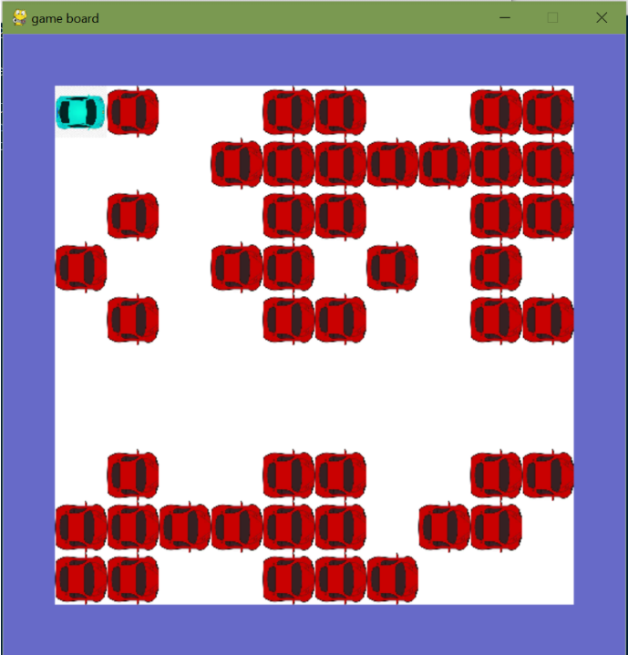
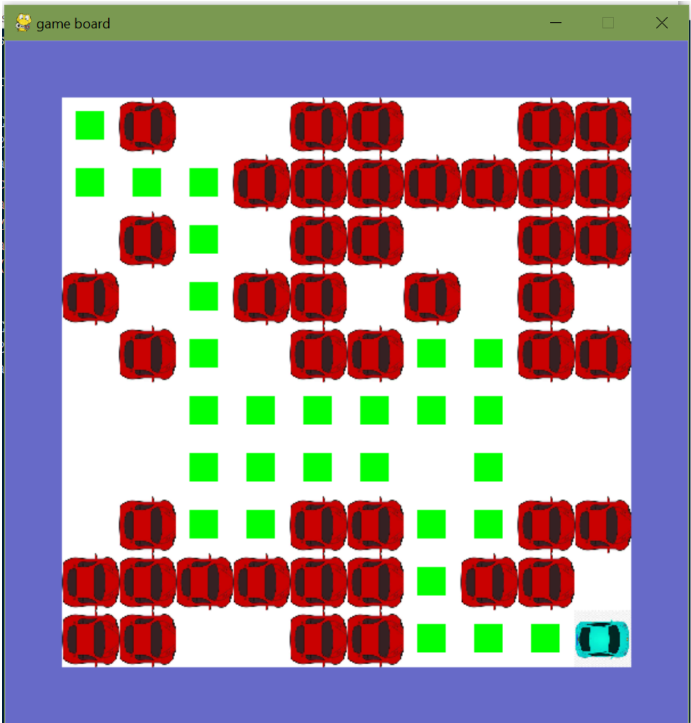

# Optimal-Path-For-Car-Parking
DAA Mini Project

# Screenshots

# Problem Statement

With rapid urbanization and increased population density in cities, there
is a heightened need for mobility solutions. Private vehicles are a preferred
mode of transportation for many people in developed economies. As the
standard of living continues to go up in several parts of the world, more and
more people and companies buy new cars. Malls and other commercial
centers are also increasing in cities, attracting more and more people who
prefer to drive in with their cars. Parking a car in the allotted place in the
parking area is always a cumbersome task in enormous malls and
hospitals etc. This has increased the need for an efficient parking lot
management system in malls to ensure people have a hassle-free experience.
An efficient algorithm is required to make sure that a person is able to park
his/her car in the allotted parking space.

## Problem Explanation 

The backtracking technique is used to solve this problem. It uses
recursive calling to find the solution by building a solution step by step
increasing values with time. It removes the solutions that don't give rise to
the problem's solution based on the constraints given to solve the problem.
Backtracking algorithm is applied to some specific types of problems,/
● Decision problem is used to find a feasible solution of the
problem./
● Optimisation problem used to find the best solution that can be
applied./
● Enumeration problem used to find the set of all feasible
solutions of the problem.

In a backtracking problem, the algorithm tries to find a sequence path to
the solution which has some small checkpoints from where the problem
can backtrack if no feasible solution is found for the problem.

## Algorithm:

Create a solution matrix, initially filled with 0’s.
Create a recursive function, which takes initial matrix, output matrix and
position of car(i, j).
if the position is out of the matrix or the position is not valid then return.
Mark the position output[i][j] as 1 and check if the current position is
destination or not. If destination is reached print the output matrix and
return.
Recursively call for position (i-1,j), (I,j-1), (i+1, j) and (i, j+1).
Unmark position (i, j), i.e output[i][j] = 0

## Complexity Analysis:

Time Complexity: O(2^(n^2)).\
The recursion can run upper-bound 2^(n^2) times.\
Space Complexity: O(n^2).\
Output matrix is required so an extra space of size n*n is needed.

Considering a grid of size MxN, and car has to move from 0,0 to M-1,N-1
(some cells may be blocked and car can move either down or right)
Now at every point car has two choices, go down or go left and to reach
destination, car has to make (M+N) moves, so total recursion complexity
turns out as O(2^(M+N)) which is very high, but there are many overlapping
recursive calls, so using DP reduces the complexity to O(MN).

